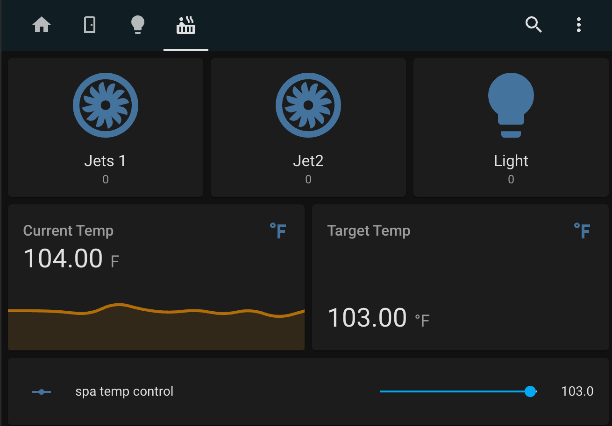
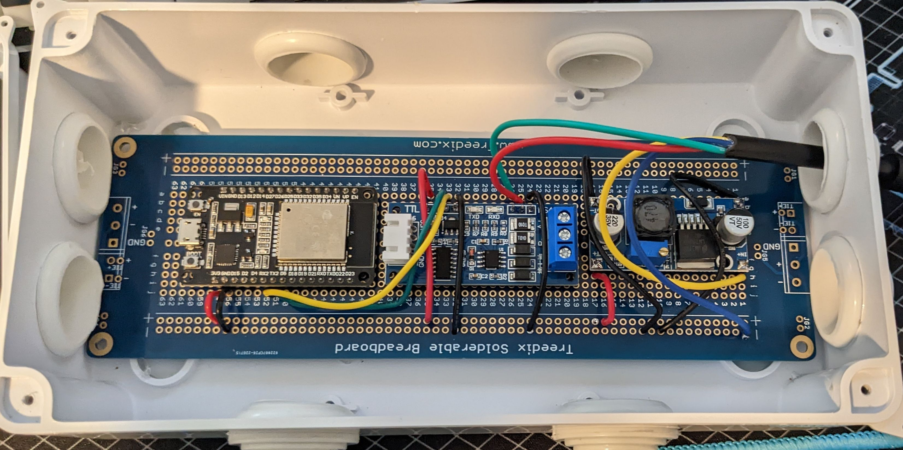

# ESPHomeSpa

This is an ESPHome version of Cribskip's esp8266 library, as such, it also runs on ESP32.

Most of the code is forked from https://github.com/cribskip/esp8266_spa 

Differences:
- doesn't use MQTT, just uses ESPHome native integration
- removed C/F temp handling, my spa was giving me inconsistent values so I hardcoded it for F
- Added ability to set time
- doesn't currently store any settings, just logs them

TODO:
- probably add a cpp file, so it's just not a header... it's a bit big for a header.
- break up files
- figure out how to have more than one sensor type since most of these should be binary sensors
- send the configs somewhere
- include some samples of how to configure dashboard 
- figure out how to distribute this properly

NOTE:
- using ESP32 devkit, I use GPIO-17/16

A dasboard I made in HomeAssistant

A picture of the board in a waterproof box.

